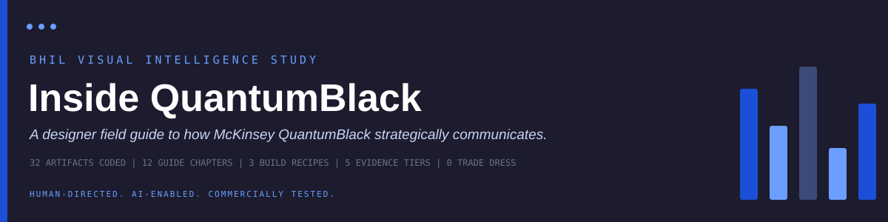
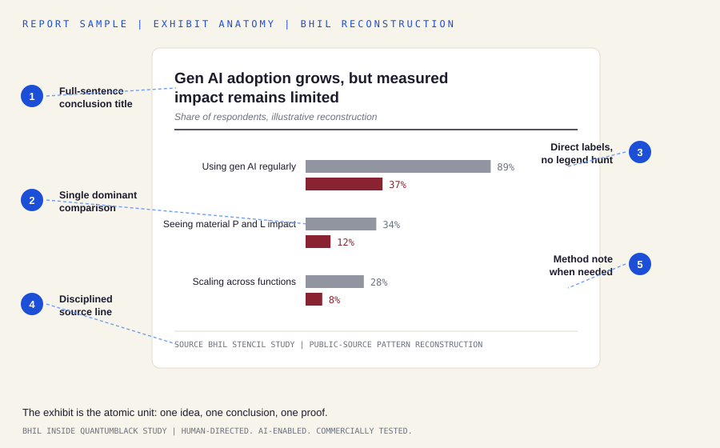
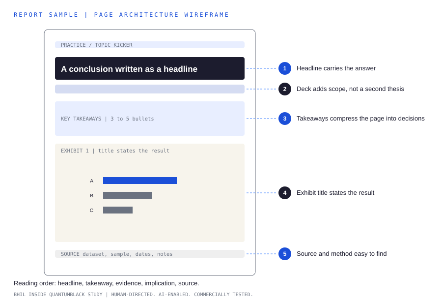
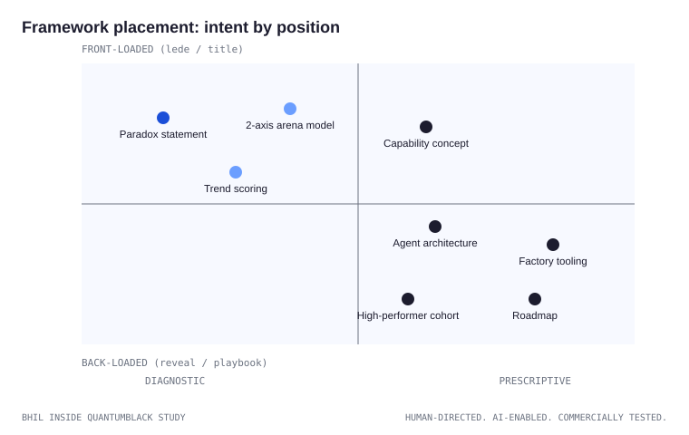
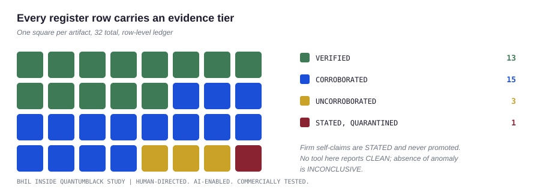
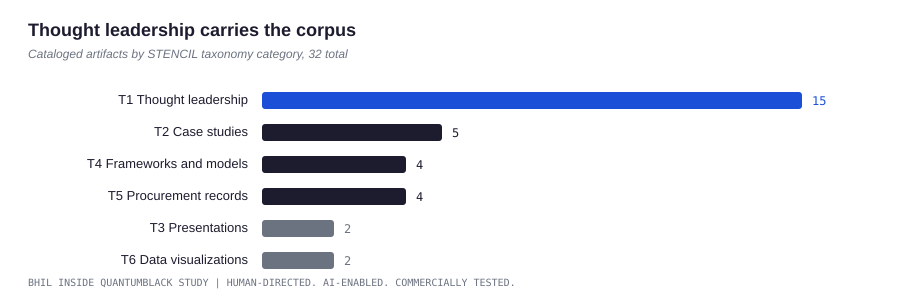
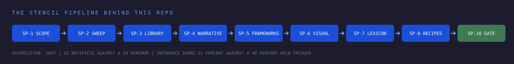

<p align="center">
  
</p>

<p align="center">
  
  
  
  
</p>

A designer field guide to how McKinsey QuantumBlack strategically
communicates, built from a BHIL STENCIL deconstruction of 32 public
artifacts. It teaches the argument structure, exhibit grammar, framework
placement, page architecture, lexical register, and publishing cadence
behind one of the most disciplined publishing systems in professional
services, then packages those observations as reusable build recipes
behind a hard intellectual-property firewall.

> **The one-line finding.** The exhibit is the atomic unit: one idea, one
> conclusion, one proof. The firm varies its vocabulary every year and its
> structure almost never.

## Pick your description

Use whichever framing fits your context; all three are char-verified for
the GitHub description field in `collateral/github-descriptions.md`.

| Audience | Description |
| --- | --- |
| Designers | A designer field guide to how McKinsey QuantumBlack strategically communicates. Narrative flow, exhibit grammar, framework placement, lexicon, cadence. Study the craft, not the costume. |
| Researchers | A STENCIL deconstruction of 32 QuantumBlack artifacts turned into a working guide: six-step narrative flow, one-idea exhibits, visible methodology, scored compendium formats. |
| Builders | Strategic communication, deconstructed and rebuilt as recipes: survey report, paradox essay, trend compendium. Five evidence tiers on every claim, drift-gated data, CI gates. |

## Report samples, visualized

Every visual below is a BHIL reconstruction generated by the tools in this
repo. Nothing is copied from source materials.

### The exhibit, annotated

The atomic unit of the whole system. Five parts, every time.

<p align="center">
  
</p>

### The page, wireframed

The page reads in a fixed order even when the topic changes: headline,
takeaway, evidence, implication, source.

<p align="center">
  
</p>

### The argument, sequenced

Six moves, in the same order, across report after report.

<p align="center">
  
</p>

### The frameworks, mapped

Diagnostic constructs appear early to create tension. Prescriptive
constructs arrive later to resolve it.

<p align="center">
  
</p>

### The vocabulary, migrating

The container is stable while the words move with the market moment.

<p align="center">
  
</p>

## The evidence base

Style advice with an evidence trail ages better than style advice with
vibes. Every claim traces to register rows; every row carries a tier.

<p align="center">
  
</p>

<p align="center">
  
</p>

<p align="center">
  
</p>

## What is inside

| Path | What it holds |
| --- | --- |
| `docs/guide/` | Twelve field-guide chapters on the communication system |
| `docs/recipes/` | Survey report, paradox essay, trend compendium, build checklist |
| `docs/method/` | The STENCIL method, evidence discipline, and IP firewall |
| `docs/registry/` | Source register (derived from CSV) and the QA ledger |
| `data/` | Canonical CSVs: source register, narrative coding, constructs |
| `tools/` | stdlib-only Python: gates, generators, validators |
| `tests/` | Regression tests; every test names the bug it prevents |
| `ADRs/` | Decision records with open questions left open on purpose |
| `collateral/` | GitHub descriptions and LinkedIn launch posts |

## Quickstart

```bash
# run every gate the CI runs
python3 tools/dash_gate.py
python3 tools/validate_register.py
python3 tools/drift_gate.py
python3 -m unittest discover -s tests -v

# regenerate derived artifacts after editing canonical sources
python3 tools/generate_register_page.py
python3 tools/generate_diagrams.py
python3 tools/generate_readme_visuals.py
python3 tools/drift_gate.py --write

# build and preview the docs site
pip install mkdocs-material
mkdocs serve
```

## Governance rules this repo enforces

* **Canonical source enforcement.** `data/source_register.csv` is the
  single source of truth; the register page and every SVG above are
  derived artifacts behind a SHA-256 drift gate. Hand edits fail CI.
* **Evidence discipline.** Five tiers, lowest defensible level. Firm
  self-claims are always STATED and never promoted. No tool here reports
  CLEAN; absence of anomaly is INCONCLUSIVE.
* **Dash gate.** Em and en dashes are banned in all prose, swept on raw
  bytes, not parsed values.
* **IP firewall.** Structural extraction only, no passing off, no
  trademarked names in generated work, no trade-dress replication. Study
  the craft, not the costume.

## Companion artifacts

* BHIL STENCIL deconstruction brief, REF STN-MCK-001/V1.
* Source register and discovery index, REF STN-MCK-001/A1.
* Inside QuantumBlack visual field guide, the 20-page PDF companion deck.

## Licensing

Dual licensed: MIT for code, schemas, and tooling; CC BY 4.0 for prose in
`docs/` and `ADRs/`. See `LICENSE` and `LICENSE-CONTENT`. This repository
is an analytical study of public materials and holds no rights to any
McKinsey and Company or QuantumBlack trademark, logo, or trade dress.

---

<p align="center">
  BHIL, Barry Hurd Intelligence Lab. Human-Directed. AI-Enabled. Commercially Tested.
</p>
