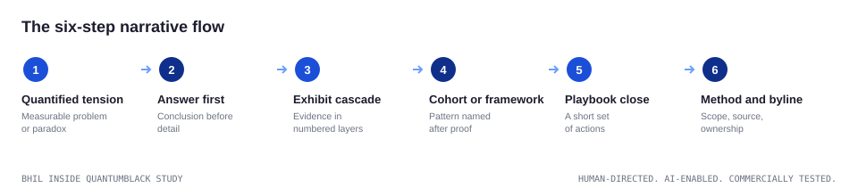

# The core pattern

QuantumBlack repeats a consistent argument structure across reports and
articles. Once you see it, you cannot unsee it, and you can build with it.

## The six-step narrative flow

1. **Quantified tension.** Start with a measurable problem, opportunity,
   or paradox. The flagship editions open with the same tension class
   every year: adoption is near universal, measured impact is thin.
2. **Answer first.** State the conclusion before the supporting detail.
   The reader should never wonder where the report is going.
3. **Exhibit cascade.** Build the evidence with charts, models, and
   comparisons, numbered in sequence, one idea each.
4. **Cohort or framework.** Name the pattern only after the evidence is
   visible. Constructs arrive when the reader is ready to generalize.
5. **Playbook close.** Turn the diagnosis into a short set of management
   actions.
6. **Method and byline.** Show scope, source, limits, and ownership.

## What repeats

* Data opens the story.
* The conclusion comes early.
* Evidence builds in layers.
* The close joins action with authority.

## Why it works for readers

* **Cuts scan time.** Answer-first pages reward a thirty-second read and a
  thirty-minute read equally.
* **Scales across topics.** The container is stable while the subject
  changes, so a returning reader already knows how to read the next report.
* **Shows the basis for trust.** Method and authorship on the page make
  the argument auditable without a meeting.

## Pattern frequency in the corpus

Coding the 32-artifact corpus against seven narrative patterns, the data
led reveal dominates with 11 artifacts, followed by the thesis antithesis
playbook with 5, client-as-hero with 4, and the remaining codes in single
digits. Tier: CORROBORATED, coded per STENCIL SP-4; full counts sit in
`data/narrative_coding.csv`.
