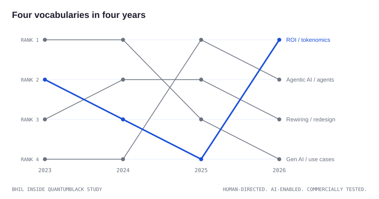

# Lexicon and register

The structure stays stable while the vocabulary shifts with the market
moment. This chapter covers both: the fixed voice and the moving words.

## Register markers, the fixed voice

1. **Answer-first sentences.** Lead with the conclusion.
2. **Quantified claims.** Present facts with numbers where the data
   supports them.
3. **Moderate hedging.** Measured language for future projections, low
   hedge on present facts.
4. **First-person plural.** A collective authorial voice.
5. **Anonymized clients.** Described by scale and industry, never named
   without permission.

## Language habits

* **Respondent percentages.** Use shares when survey data supports the
  point.
* **Precision bands.** Ranges rather than false precision.
* **Executive tone.** Clear, measured, business-oriented.
* **Playbook verbs.** Direct verbs for actions and choices.

## The vocabulary migration

Across the study window the headline vocabulary tracked the next
executive question: adoption language in the earliest editions, then
rewiring and workflow redesign, then agents and agentic language, then
return-on-investment and cost economics. Rank order by publication year
sits in the diagram above; the migration is the clearest evidence that
the container is stable while the contents move. Tier: CORROBORATED from
term scans across the T1 corpus.

## Writing to the register without impersonating it

Adopt the discipline: conclusions first, numbers where they exist, hedges
only on futures, sources visible. Do not adopt the identity: coined
construct names, brand phrases, and the firm's collective voice belong to
the firm. The register is a craft standard; the vocabulary is a costume.
